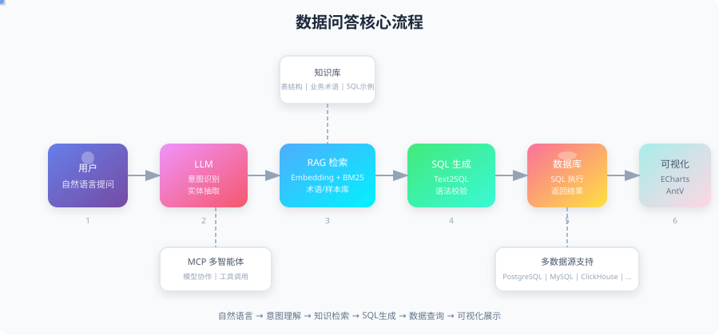

<p align="center">
  <a href="https://github.com/apconw/Aix-DB">
    
  </a>
</p>

<h3 align="center">Aix-DB - LLM Data Assistant</h3>

<p align="center">
  An intelligent data analytics system powered by Large Language Models and RAG technology, enabling conversational data analysis (ChatBI) for rapid data extraction and visualization
</p>


<p align="center">
  <a href="https://github.com/apconw/Aix-DB/releases"></a>
  <a href="https://github.com/apconw/Aix-DB/stargazers"></a>
  <a href="https://github.com/apconw/Aix-DB/blob/master/LICENSE"></a>
  <a href="https://hub.docker.com/r/apcon/aix-db"></a>
</p>

<p align="center">
  <a href="./README.md">简体中文</a> | <a href="./README_en.md">English</a>
</p>

<p align="center">
  <b>🚀 Looking for Enterprise AI Solutions?</b>
</p>

<p align="center">
  <a href="http://www.aixhub.top/"></a>
</p>

<p align="center">
  Our commercial product with powerful enterprise features:<br/>
  Private Deployment · Custom Development · Dedicated Support · Multi-scenario AI Applications
</p>

<p align="center">
  <b>👇 Click to Experience Now 👇</b>
</p>

<p align="center">
  <a href="YOUR_CHAT_URL"></a>
  <a href="YOUR_DATA_URL"></a>
  <a href="http://www.aixhub.top:5006"></a>
</p>

<p align="center">
  <sub>💼 For business inquiries, please contact us via WeChat (note "Business Cooperation") | <a href="http://www.aixhub.top/">Contact Us</a></sub>
</p>

Aix-DB is built on the **LangChain/LangGraph** framework, combined with **MCP Skills** multi-agent collaboration architecture, enabling end-to-end transformation from natural language to data insights.

**Core Capabilities**: General Q&A · Data Q&A (Text2SQL) · Spreadsheet Q&A · Deep Research · Data Visualization · MCP Multi-Agent

**Product Features**: 📦 Ready to Use · 🔒 Secure & Controllable · 🔌 Easy Integration · 🎯 Increasingly Accurate

---

## Demo Video

<table align="center">
  <tr>
    <th>🎯 Skill Mode</th>
    <th>💬 Standard Mode</th>
  </tr>
  <tr>
    <td>
      <video src="https://github.com/user-attachments/assets/ee09d321-4534-4ccf-aa71-ecab83d91caf" controls="controls" muted="muted" style="max-height:320px; min-height: 150px;"></video>
    </td>
    <td>
      <video src="https://github.com/user-attachments/assets/462f4e2e-86e0-4d2a-8b78-5d6ca390c03c" controls="controls" muted="muted" style="max-height:320px; min-height: 150px;"></video>
    </td>
  </tr>
</table>

---

## System Architecture

<p align="center">
  
</p>

**Layered Architecture Design:**

- **Frontend Layer**: Modern web interface built with Vue 3 + TypeScript, integrated with ECharts and AntV visualization components
- **API Gateway Layer**: High-performance async API service based on FastAPI + Uvicorn, providing RESTful interfaces and JWT authentication
- **Intelligent Service Layer**: LLM services, Text2SQL Agent, RAG retrieval engine, MCP multi-agent collaboration
- **Data Storage Layer**: Support for multiple database types including relational databases, vector databases, graph databases, and file storage

---

## Supported Data Sources

<p align="center">
  
  
  
  
</p>
<p align="center">
  
  
  
  
</p>
<p align="center">
  
  
  
</p>


<p align="center">
  
</p>

| Step | Module | Description |
|:---:|--------|-------------|
| 1 | **User Input** | User asks data query questions in natural language |
| 2 | **LLM Intent Understanding** | LLM parses question intent, extracts key entities and query conditions |
| 3 | **RAG Knowledge Retrieval** | Embedding + BM25 hybrid retrieval, combined with Neo4j graph to obtain relevant table structures and business knowledge |
| 4 | **SQL Generation** | Text2SQL engine generates SQL statements with syntax validation and optimization |
| 5 | **Database Execution** | Execute SQL on target data source, supporting 8+ database types |
| 6 | **Visualization** | Automatically generate ECharts/AntV charts to present analysis results |


---

## Quick Start

### Deploy with Docker (Recommended)

```bash
docker run -d \
  --name aix-db \
  --restart unless-stopped \
  -e TZ=Asia/Shanghai \
  -e SERVER_HOST=0.0.0.0 \
  -e SERVER_PORT=8088 \
  -e SERVER_WORKERS=2 \
  -e LANGFUSE_TRACING_ENABLED=false \
  -e LANGFUSE_SECRET_KEY= \
  -e LANGFUSE_PUBLIC_KEY= \
  -e LANGFUSE_BASE_URL= \
  -p 18080:80 \
  -p 18088:8088 \
  -p 15432:5432 \
  -p 9000:9000 \
  -p 9001:9001 \
  -v ./volume/pg_data:/var/lib/postgresql/data \
  -v ./volume/minio/data:/data \
  -v ./volume/logs/supervisor:/var/log/supervisor \
  -v ./volume/logs/nginx:/var/log/nginx \
  -v ./volume/logs/aix-db:/var/log/aix-db \
  -v ./volume/logs/minio:/var/log/minio \
  -v ./volume/logs/postgresql:/var/log/postgresql \
  --add-host host.docker.internal:host-gateway \
  crpi-7xkxsdc0iki61l0q.cn-hangzhou.personal.cr.aliyuncs.com/apconw/aix-db:1.2.3
```

> **Note**: To enable Langfuse full-chain tracing, set `LANGFUSE_TRACING_ENABLED=true` and configure the corresponding keys and URL.

### Deploy with Docker Compose

```bash
git clone https://github.com/apconw/Aix-DB.git
cd Aix-DB/docker
cp .env.template .env  # Copy env template, modify as needed
docker-compose up -d
```

### Access the System

**Web Management Interface**
- URL: http://localhost:18080
- Username: `admin`
- Password: `123456`

**PostgreSQL Database**
- Connection: `localhost:15432`
- Database: `aix_db`
- Username: `aix_db`
- Password: `1`

### Local Development

**① Clone the Repository**
```bash
git clone https://github.com/apconw/Aix-DB.git
cd Aix-DB
```

**② Start Middleware Dependencies** (PostgreSQL, MinIO, etc.)
```bash
cd docker
docker-compose up -d
```

**③ Configure Environment Variables**

Edit `.env.dev` in the project root to set database connection, MinIO address, etc. (default config works out of the box)

**④ Install Python Dependencies** (requires Python 3.12)
```bash
# Option 1: pip
pip install -r requirements.txt

# Option 2: uv (recommended, faster)
uv venv --python 3.12
source .venv/bin/activate
uv sync
```

**⑤ Start Backend Service**
```bash
python serv.py
```

**⑥ Start Frontend Dev Server** (in another terminal)
```bash
cd web
npm install
npm run dev
```

---

## Tech Stack

**Backend**: FastAPI · Uvicorn · SQLAlchemy · LangChain/LangGraph · Neo4j · FAISS/Chroma · MinIO

**Frontend**: Vue 3 · TypeScript · Vite 5 · Naive UI · ECharts · AntV

**AI Models**: OpenAI · Anthropic · DeepSeek · Qwen · Ollama

---

## Documentation
- [Configuration Guide](./docs/docs/index.md)
- [API Documentation](http://localhost:8088/docs) (available after startup)


---

## Contributing

We welcome Issues and Pull Requests!

1. Fork this repository
2. Create a feature branch (`git checkout -b feature/AmazingFeature`)
3. Commit your changes (`git commit -m 'Add some AmazingFeature'`)
4. Push to the branch (`git push origin feature/AmazingFeature`)
5. Open a Pull Request

---

## Contact Us

If you have any questions, feel free to reach out:

- [GitHub Issues](https://github.com/apconw/Aix-DB/issues)

---

## Star History

[](https://star-history.com/#apconw/Aix-DB&Date)

---

## License

This project is licensed under the [Apache License 2.0](./LICENSE).
