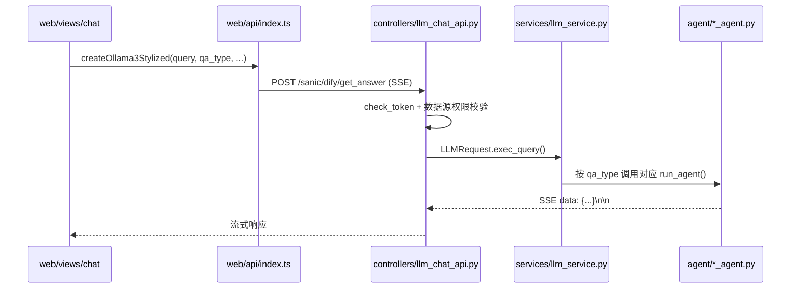

# 源码理解指南

本文档从前端到后端串联整个项目，说明各层代码职责、调用链路，以及 Agent / RAG / MCP 的真实落点。

> 阅读建议：先通读「请求全链路」，再按你关心的 `qa_type` 深入对应 Agent 章节。

---

## 目录

- [1. 项目结构总览](#1-项目结构总览)
- [2. 请求全链路（前端 → 后端）](#2-请求全链路前端--后端)
- [3. 四种问答模式与 Agent 路由](#3-四种问答模式与-agent-路由)
- [4. Text2SQL Agent（DATABASE_QA）](#4-text2sql-agentdatabase_qa)
- [5. RAG 检索引擎（真实实现）](#5-rag-检索引擎真实实现)
- [6. 表关系：PostgreSQL vs Neo4j](#6-表关系postgresql-vs-neo4j)
- [7. 智能问答 Agent（COMMON_QA）](#7-智能问答-agentcommon_qa)
- [8. 深度问数 Agent（REPORT_QA）](#8-深度问数-agentreport_qa)
- [9. 表格问答 Agent（FILEDATA_QA）](#9-表格问答-agentfiledata_qa)
- [10. SSE 流式协议](#10-sse-流式协议)
- [11. 配置与前置依赖](#11-配置与前置依赖)
- [12. 关键文件索引](#12-关键文件索引)

---

## 1. 项目结构总览

```
Ai-Chat-DB/
├── serv.py                    # FastAPI 入口，自动注册 controllers
├── config/load_env.py         # 加载根目录 .env
├── controllers/               # REST API（按模块拆分）
├── services/                  # 业务服务层（路由到 Agent）
├── agent/                     # 四套独立 Agent 系统（互不共享核心逻辑）
│   ├── common/                # COMMON_QA：DeepAgents + Skill + MCP
│   ├── text2sql/              # DATABASE_QA：LangGraph Text2SQL
│   ├── excel/                 # FILEDATA_QA：Excel + DuckDB
│   └── deepagent/             # REPORT_QA：深度研究 + SQL 工具
├── common/                    # LLM、MinIO、数据源连接等工具
├── model/                     # SQLAlchemy 模型 + Pydantic Schema
└── web/                       # Vue 3 前端
    └── src/
        ├── api/index.ts       # 聊天 SSE、登录等 API
        ├── views/chat/        # 主聊天界面
        └── store/business/    # qa_type、数据源等状态
```

**设计原则**：Agent 四套系统独立实现，通过 `services/llm_service.py` 的 `qa_type` 分发，不要假设它们共享同一套 RAG 或 MCP 逻辑。

---

## 2. 请求全链路（前端 → 后端）



### 2.1 前端入口

| 文件 | 作用 |
| --- | --- |
| `web/src/views/chat/index.vue` | 主聊天页，维护 `qa_type`、消息列表、SSE 解析 |
| `web/src/views/chat/default-page.vue` | 首页输入框，模式切换（智能/数据/表格/深度） |
| `web/src/api/index.ts` | `createOllama3Stylized()` → `POST /sanic/dify/get_answer` |
| `web/src/store/business/index.ts` | Pinia 全局状态：`qa_type`、`datasource_id`、`file_list` |

前端请求体核心字段：

```json
{
  "query": "用户问题",
  "qa_type": "DATABASE_QA",
  "chat_id": "会话ID",
  "uuid": "单次问答ID",
  "datasource_id": 1,
  "file_list": [],
  "selected_skills": ["pdf"]
}
```

### 2.2 后端入口

| 文件 | 作用 |
| --- | --- |
| `serv.py` | 启动 FastAPI，`autodiscover(controllers)` 自动注册路由 |
| `controllers/llm_chat_api.py` | `POST /dify/get_answer`，JWT 校验，SSE 包装 |
| `services/llm_service.py` | **`exec_query()` 核心路由**，按 `qa_type` 分发 Agent |
| `common/sse_stream.py` | SSE 响应封装 |
| `common/token_decorator.py` | `@check_token` JWT 鉴权 |

### 2.3 LLM 配置来源（易忽略）

所有 Agent 通过 `common/llm_util.py` 的 `get_llm()` 获取模型，**读取数据库表 `t_ai_model`**，不是 `.env` 中的 API Key：

```python
# common/llm_util.py
model = session.query(TAiModel).filter(
    TAiModel.default_model == True,
    TAiModel.model_type == 1,  # 1=大语言模型
).first()
```

因此：**未在 Web 管理界面配置默认 LLM，任何 Agent 都无法运行。**

---

## 3. 四种问答模式与 Agent 路由

| 前端模式 | `qa_type` | Agent 类 | 入口文件 |
| --- | --- | --- | --- |
| 智能问答 | `COMMON_QA` | `EnhancedCommonAgent` | `agent/common/enhanced_common_agent.py` |
| 数据问答 | `DATABASE_QA` | `Text2SqlAgent` | `agent/text2sql/text2_sql_agent.py` |
| 表格问答 | `FILEDATA_QA` | `ExcelAgent` | `agent/excel/excel_agent.py` |
| 深度问数 | `REPORT_QA` | `DeepAgent` | `agent/deepagent/deep_research_agent.py` |

路由代码（`services/llm_service.py`）：

```python
if qa_type == IntentEnum.COMMON_QA.value[0]:
    await common_agent.run_agent(...)
elif qa_type == IntentEnum.DATABASE_QA.value[0]:
    await sql_agent.run_agent(...)
elif qa_type == IntentEnum.FILEDATA_QA.value[0]:
    await excel_agent.run_excel_agent(...)
elif qa_type == IntentEnum.REPORT_QA.value[0]:
    await deep_agent.run_agent(...)
```

**为什么「感觉不到 Agent」**：默认模式是 `COMMON_QA`，界面像一个普通聊天框；Text2SQL / RAG 只在切换到「数据问答」并选择数据源后才会触发。

---

## 4. Text2SQL Agent（DATABASE_QA）

### 4.1 LangGraph 流水线

定义于 `agent/text2sql/analysis/graph.py`：

```
datasource_selector
    → schema_inspector      # 表结构混合检索（BM25 + FAISS）
    → early_recommender     # 后台生成推荐问题
    → sql_generator         # RAG 增强 + LLM 生成 SQL
    → permission_filter     # 行级权限注入
    → sql_executor          # 执行 SQL
    → parallel_collector    # 并行：图表 + 总结
    → unified_collector     # 汇总输出
    → END
```

异常分支：`datasource_selector` 失败 → `error_handler` → `END`

### 4.2 执行器

`agent/text2sql/text2_sql_agent.py` 的 `Text2SqlAgent.run_agent()`：

1. 构建 `AgentState`（用户问题、数据源 ID、用户 ID）
2. `create_graph(datasource_id)` 编译 LangGraph
3. `graph.astream()` 逐步执行，每步通过 SSE 推送 `t14` 步骤进度
4. 最终推送 `t02` 文本答案、`t04` 图表数据、`t99` 结束

### 4.3 表结构检索（schema_inspector）

`agent/text2sql/database/db_service.py` 的 `DatabaseService.get_table_schema()`：

- 从 PostgreSQL 元数据表读取已同步的表/字段信息
- **BM25**（`rank_bm25`）关键词匹配
- **FAISS** 向量检索（需 Embedding 模型或预计算向量）
- 可选 **Rerank** 模型重排序
- 通过 `supplement_related_tables()` 从数据源 `table_relation` JSON 补充关联表

---

## 5. RAG 检索引擎（真实实现）

RAG **不是独立服务**，而是嵌入 Text2SQL 流水线的两个节点：

### 5.1 表结构 RAG（schema_inspector 节点）

| 技术 | 文件 | 说明 |
| --- | --- | --- |
| BM25 + FAISS 混合检索 | `agent/text2sql/database/db_service.py` | 从候选表中选出与问题相关的表 |
| Embedding | `services/embedding_service.py` | 优先用 DB 配置的 Embedding 模型，否则回退本地 CPU 模型 |
| Rerank | `db_service.py` | 可选，需配置 Rerank 模型（model_type=3） |

### 5.2 业务知识 RAG（sql_generator 节点）

| 类型 | 文件 | 数据来源 |
| --- | --- | --- |
| 术语检索 | `agent/text2sql/rag/terminology_retriever.py` | `t_terminology` 表，关键词 + 向量混合 |
| 训练样本检索 | `agent/text2sql/rag/training_retriever.py` | `t_data_training` 表，需 `datasource_id` |

调用点（`agent/text2sql/sql/generator.py`）：

```python
terminologies = retrieve_terminologies(question=..., datasource_id=...)
data_training = retrieve_training_examples(question=..., datasource_id=...)
```

失败时静默降级为空字符串，继续生成 SQL，**界面上无 RAG 失败提示**。

### 5.3 RAG 生效的前置条件

1. 使用「数据问答」模式并选择数据源
2. 在「系统设置 → 模型配置」配置 Embedding 模型（否则仅 BM25）
3. 在后台录入术语库 / SQL 训练样本（否则术语/样本 RAG 返回空）
4. 数据源已完成表结构同步

---

## 6. 表关系：PostgreSQL vs Neo4j

这是最容易混淆的部分。

### 6.1 Text2SQL 实际使用的表关系

**来源**：PostgreSQL `datasource.table_relation` 字段（前端 ER 图保存的 JSON）

**使用位置**：

| 场景 | 文件 | 方法 |
| --- | --- | --- |
| Text2SQL 补充关联表 | `db_service.py` | `supplement_related_tables()` |
| 深度问数 SQL 工具 | `deepagent/tools/native_sql_tools.py` | `_get_table_relationships_from_datasource()` |

**不依赖 Neo4j。**

### 6.2 Neo4j 的实际用途（可选）

Neo4j 仅用于**数据源管理的可视化与离线工具**，不参与 Text2SQL 主流程：

| 用途 | 文件 |
| --- | --- |
| 保存表关系时同步到 Neo4j | `services/datasource_service.py` → `sync_table_relation_to_neo4j()` |
| 前端 Neo4j 关系图展示 | `web/src/views/datasource/neo4j-relationship.vue` |
| API 查询 Neo4j 关系 | `controllers/datasource_api.py` → `getNeo4jRelation/{ds_id}` |
| 离线导入工具 | `common/neo4j/`、`common/initialize_neo4j.py` |

若未部署 Neo4j：表关系仍保存在 PostgreSQL，Text2SQL 和深度问数**正常工作**；仅 Neo4j 可视化页面无数据。

### 6.3 已移除的过时实现

`agent/text2sql/database/neo4j_search.py` 曾为 LangGraph 的 `table_relationship` 节点服务，该节点已从 `graph.py` 移除，对应代码已清理。

---

## 7. 智能问答 Agent（COMMON_QA）

### 7.1 架构

`agent/common/enhanced_common_agent.py` 基于 **DeepAgents**（`create_deep_agent`）：

```
用户问题
  → create_deep_agent(model, tools, skills, memory)
  → 流式输出（<details> 包裹思考/工具调用过程）
  → SSE 推送
```

### 7.2 Skill 模式

- Skill 文件：`agent/common/skills/*/SKILL.md`（pdf、docx、xlsx、pptx、web-access 等）
- 加载方式：默认加载整个 `skills/` 目录，或通过 `/技能名` 指定 `selected_skills`
- 技能中心：`web/src/views/skill-center.vue`，API：`GET /system/skill/list`
- Skill 是**指令文档**注入 LLM 上下文，不是独立可执行服务

### 7.3 MCP 多智能体

```python
# enhanced_common_agent.py
mcp_url = os.environ.get("MCP_HUB_COMMON_QA_GROUP_URL")
if not mcp_url:
    return []  # MCP 工具不可用，降级为 LLM + Skill
```

**必须在 `.env` 配置 `MCP_HUB_COMMON_QA_GROUP_URL` 并部署 mcp-hub 服务**，否则 README 中的「MCP 多智能体」在运行时不可见。

### 7.4 文件能力依赖 MinIO

`MINIO_ENABLED=false`（当前默认）时，涉及文件上传/下载的 Skill 不可用。

---

## 8. 深度问数 Agent（REPORT_QA）

`agent/deepagent/deep_research_agent.py`：

- 基于 `create_deep_agent` + SQL 原生工具（`native_sql_tools.py`）
- 工具：`sql_db_list_tables`、`sql_db_schema`、`sql_db_query`、`sql_db_table_relationship` 等
- 表关系从 `Datasource.table_relation`（PostgreSQL）读取，非 Neo4j
- Skill：`agent/deepagent/skills/`（如 `report-generation`、`schema-exploration`）
- 多阶段追踪：PLANNING → EXECUTION → SUB_AGENT → REPORTING

---

## 9. 表格问答 Agent（FILEDATA_QA）

`agent/excel/excel_agent.py` + `agent/excel/excel_graph.py`：

1. 用户上传 Excel → MinIO 存储
2. 解析为 DuckDB 内存表
3. LangGraph 流水线：映射 → SQL 生成 → 执行 → 图表 → 总结

依赖：`MINIO_ENABLED=true` 且 MinIO 服务可用。

---

## 10. SSE 流式协议

所有 Agent 统一格式（`constants/code_enum.py` → `DataTypeEnum`）：

```
data:{"data":{"messageType":"continue","content":"..."},"dataType":"t02"}\n\n
```

| dataType | 含义 |
| --- | --- |
| `t02` | 文本答案（含 HTML `<details>` 思考块） |
| `t04` | 业务数据（图表 JSON） |
| `t12` | 记录 ID |
| `t14` | 步骤进度（Text2SQL 流水线） |
| `t15` | 需要用户输入（interrupt 恢复） |
| `t99` | 流结束 |

前端解析：`web/src/views/chat/index.vue` 中按 `dataType` 分支渲染。

---

## 11. 配置与前置依赖

### 11.1 环境变量（`.env`）

| 变量 | 作用 |
| --- | --- |
| `SQLALCHEMY_DATABASE_URI` | 应用元数据库（PostgreSQL） |
| `SERVER_PORT` / `SERVER_WORKERS` | 后端服务 |
| `MINIO_ENABLED` | 文件存储开关 |
| `MCP_HUB_COMMON_QA_GROUP_URL` | MCP 工具 Hub（COMMON_QA 专用） |
| `NEO4J_URI` / `NEO4J_USER` / `NEO4J_PASSWORD` | 可选，仅数据源 Neo4j 可视化 |
| `LANGFUSE_*` | 可选，链路追踪 |

### 11.2 各能力启用清单

| 能力 | 必要条件 |
| --- | --- |
| 任意 Agent | Web 界面配置默认 LLM（`t_ai_model`） |
| 数据问答 + RAG | 配置数据源 + 选 DATABASE_QA 模式 |
| 向量 RAG | 配置 Embedding 模型或本地 embedding |
| 术语/样本 RAG | 后台录入术语库和训练样本 |
| MCP 工具 | 配置 `MCP_HUB_COMMON_QA_GROUP_URL` |
| Skill 文件处理 | `MINIO_ENABLED=true` |
| Neo4j 关系图 | 部署 Neo4j + 配置 `NEO4J_*` |
| 表格问答 | MinIO + 上传 Excel 文件 |

---

## 12. 关键文件索引

### 前端

| 路径 | 说明 |
| --- | --- |
| `web/src/api/index.ts` | 聊天 SSE API |
| `web/src/views/chat/index.vue` | 主聊天逻辑 |
| `web/src/views/chat/default-page.vue` | 模式切换 UI |
| `web/src/views/skill-center.vue` | 技能中心 |
| `web/src/views/datasource/` | 数据源管理（含表关系 ER 图） |

### 后端路由

| 路径 | 说明 |
| --- | --- |
| `controllers/llm_chat_api.py` | 聊天主接口 |
| `controllers/datasource_api.py` | 数据源 CRUD、Neo4j 关系查询 |
| `controllers/skill_api.py` | 技能管理 |
| `services/llm_service.py` | Agent 分发中枢 |

### Agent 核心

| 路径 | 说明 |
| --- | --- |
| `agent/text2sql/analysis/graph.py` | Text2SQL LangGraph 定义 |
| `agent/text2sql/database/db_service.py` | 表结构 BM25+FAISS 检索 |
| `agent/text2sql/rag/` | 术语/训练样本 RAG |
| `agent/text2sql/sql/generator.py` | SQL 生成 + RAG 注入 |
| `agent/common/enhanced_common_agent.py` | 智能问答 DeepAgent |
| `agent/deepagent/deep_research_agent.py` | 深度问数 |
| `agent/excel/excel_graph.py` | 表格问答 LangGraph |

### 公共模块

| 路径 | 说明 |
| --- | --- |
| `common/llm_util.py` | LLM 实例化（读 DB 配置） |
| `services/embedding_service.py` | Embedding 生成 |
| `services/datasource_service.py` | 数据源服务（含表关系同步） |
| `config/load_env.py` | 加载 `.env` |

---

## 附录：快速验证路径

```bash
# 1. 配置环境
cp .env.example .env

# 2. 启动后端
python serv.py

# 3. 启动前端
cd web && npm run dev

# 4. Web 界面：系统设置 → 配置默认 LLM
# 5. 数据源管理 → 添加并同步数据源
# 6. 聊天页切换「数据问答」→ 选择数据源 → 提问「有哪些表」
#    应看到 t14 步骤进度：表结构检索 → SQL生成 → ...
```
